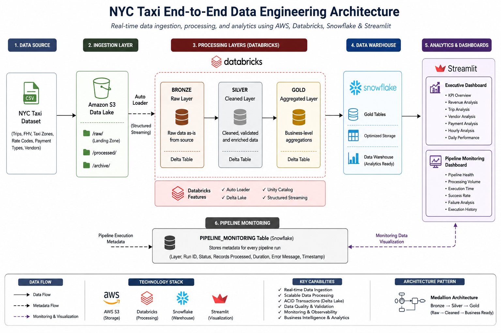

# 🚖 NYC Taxi End-to-End Data Engineering Pipeline
A production-inspired end-to-end Data Engineering solution that ingests raw NYC Taxi trip records into an AWS Data Lake, processes them using Databricks' Medallion Architecture, stores business-ready analytics in Snowflake, and delivers interactive Executive Analytics and Pipeline Monitoring dashboards through Streamlit.

# Project Overview
Modern organizations generate massive volumes of raw operational data every day. Transforming this data into reliable, governed, and analytics-ready datasets requires a scalable architecture capable of handling ingestion, transformation, monitoring, storage, and visualization while maintaining security, reliability, and data quality.

This project demonstrates a complete cloud-based Data Engineering pipeline built using industry-standard technologies including Amazon S3, Databricks, Delta Lake, Unity Catalog, Snowflake, and Streamlit.

The solution follows the Medallion Architecture (Bronze → Silver → Gold) to progressively refine raw taxi trip data into trusted business datasets. Automated ingestion is implemented using Databricks Auto Loader with Structured Streaming, while Delta Lake provides ACID transactions, schema enforcement, and scalable storage.

Business-ready Gold tables are loaded into Snowflake to support interactive analytics. Two Streamlit applications provide insights into both business performance and operational health through dedicated Executive Analytics and Pipeline Monitoring dashboards.

Beyond analytics, the project also implements production-oriented engineering practices such as IAM-based cloud access, Databricks Secret Scopes, execution logging, checkpointing, monitoring, and workflow orchestration to simulate a real-world enterprise data platform.

# Business Problem
The NYC Taxi dataset contains millions of trip records generated by taxi operations across New York City. While the raw data captures valuable operational information—including trip duration, distance, fares, payment methods, pickup locations, and vendor information—it is not immediately suitable for reporting or business intelligence.

Organizations require an automated data platform capable of:

Continuously ingesting new trip records.
Storing raw data reliably without modification.
Cleaning and validating incoming datasets.
Creating trusted business metrics.
Monitoring pipeline health.
Providing real-time analytics through dashboards.
Maintaining secure access to cloud resources.
Supporting scalable future growth.

This project addresses these requirements by implementing a complete cloud-native Data Engineering architecture.

# Solution Overview
The solution follows a modern Lakehouse architecture that combines scalable cloud storage, distributed data processing, enterprise data warehousing, and interactive visualization.

The overall workflow begins with raw NYC Taxi CSV files being stored inside Amazon S3. Databricks Auto Loader continuously detects newly available files and incrementally ingests them using Structured Streaming with the AvailableNow trigger.

Incoming records are stored in the Bronze layer without modification to preserve raw source data. The Silver layer performs data cleansing, validation, enrichment, and standardization before business aggregations are generated within the Gold layer.

Gold datasets are subsequently loaded into Snowflake, where they serve as the analytical foundation for two Streamlit applications:

Executive Analytics Dashboard
Pipeline Monitoring Dashboard

Throughout the pipeline, execution metadata is captured inside a dedicated PIPELINE_MONITORING table, enabling visibility into processing duration, execution status, processed records, errors, and overall pipeline health.

# Solution Architecture

The architecture illustrates the complete data lifecycle from ingestion to business intelligence while highlighting the interactions between AWS, Databricks, Snowflake, and Streamlit.

# Technology Stack

| Category             | Technology           |
| -------------------- | -------------------- |
| Cloud Storage        | Amazon S3            |
| Processing Engine    | Databricks           |
| Streaming            | Auto Loader          |
| Processing Framework | Structured Streaming |
| Storage Format       | Delta Lake           |
| Data Governance      | Unity Catalog        |
| Programming Language | Python               |
| Query Language       | SQL                  |
| Data Warehouse       | Snowflake            |
| Visualization        | Streamlit            |
| Version Control      | Git & GitHub         |

# Repository Structure
The repository is organized to separate data processing logic, visualization, architecture documentation, SQL scripts, and project assets. This modular structure improves maintainability, enables easier collaboration, and mirrors the organization commonly found in production Data Engineering projects.

# End-to-End Data Flow
The pipeline follows a modern cloud-native Lakehouse architecture that incrementally ingests raw taxi trip records from Amazon S3, transforms the data using Databricks, stores curated datasets within Snowflake, and presents business insights through Streamlit dashboards.

The complete workflow consists of the following stages:

1. Raw NYC Taxi CSV files are uploaded into an Amazon S3 bucket.
2. Databricks Auto Loader continuously monitors the S3 location for newly available files.
3. Structured Streaming ingests new data into the Bronze Delta table using the AvailableNow trigger.
4. The Silver layer performs data cleansing, validation, and enrichment while applying business rules.
5. The Gold layer generates aggregated business metrics optimized for analytics.
6. Gold datasets are exported into Snowflake.
7. Snowflake serves as the analytical data warehouse powering Streamlit dashboards.
8. Pipeline execution metadata is written into the PIPELINE_MONITORING table to support operational monitoring.

This layered architecture isolates raw ingestion from transformation logic while ensuring reliable, scalable, and maintainable data processing.

# AWS Infrastructure
Amazon Web Services serves as the cloud storage layer of the solution.

An Amazon S3 bucket acts as the centralized Data Lake where raw NYC Taxi datasets are stored before processing begins. The bucket provides durable, scalable, and cost-effective object storage capable of handling large volumes of structured data.

The S3 bucket contains dedicated folders for raw source files and streaming checkpoints. Raw CSV files are placed within the ingestion directory, while checkpoint data is maintained separately to support Structured Streaming fault tolerance and exactly-once processing.

Separating raw files from checkpoint metadata simplifies pipeline maintenance while allowing individual processing layers to resume execution safely after interruptions.

# Secure AWS Authentication using IAM Roles
Rather than embedding AWS credentials directly inside notebooks, the project follows security best practices by granting Databricks access to Amazon S3 through an AWS Identity and Access Management (IAM) Role.

The IAM Role defines a least-privilege permission model that allows Databricks to read raw datasets, write processed outputs, and maintain checkpoint directories without exposing long-term AWS access keys.

The role is attached to the Databricks workspace through an instance profile, enabling temporary credentials to be issued automatically whenever compute resources interact with Amazon S3.

Using IAM Roles provides several advantages:

Eliminates hardcoded AWS credentials.
Supports temporary credential generation.
Simplifies credential rotation.
Improves overall security posture.
Follows AWS security best practices.

# Databricks Secret Scopes
Sensitive configuration values such as Snowflake usernames, passwords, account identifiers, warehouse names, and database credentials are never stored directly within notebooks.

Instead, Databricks Secret Scopes provide a secure mechanism for retrieving confidential information during runtime.

Secrets are referenced programmatically whenever authenticated connections are established, ensuring that credentials remain encrypted and inaccessible to notebook users.

Example secret retrieval:

sfUser = dbutils.secrets.get(
    scope="snowflake_scope",
    key="username"
)

sfPassword = dbutils.secrets.get(
    scope="snowflake_scope",
    key="password"
)

This approach prevents accidental credential exposure within source code, Git repositories, and notebook revision history while enabling secure deployment across multiple environments.

# Databricks Processing Layer
Databricks serves as the primary distributed processing engine responsible for ingesting, transforming, validating, and aggregating the NYC Taxi dataset.

The pipeline is implemented using PySpark notebooks and follows the Medallion Architecture to progressively improve data quality across multiple processing stages.

Several Databricks capabilities are leveraged throughout the solution, including:

Auto Loader
Structured Streaming
Delta Lake
Unity Catalog
Checkpointing
Databricks Workflows

Together, these services enable scalable ingestion, transactional storage, schema evolution, reliable execution, and automated pipeline orchestration.

# Databricks Auto Loader
Auto Loader provides incremental file ingestion by continuously monitoring the Amazon S3 ingestion directory for newly uploaded files.

Unlike traditional batch ingestion methods that repeatedly scan entire directories, Auto Loader efficiently identifies only new files that have not yet been processed. This significantly reduces storage API calls while improving scalability for continuously growing datasets.

Within this project, Auto Loader automatically detects incoming NYC Taxi CSV files and initiates Structured Streaming ingestion into the Bronze layer.

Key benefits include:
Incremental file discovery
Automatic schema inference
Schema evolution support
Scalable cloud file ingestion
Reduced processing overhead

# Structured Streaming
The ingestion pipeline is implemented using Spark Structured Streaming with the AvailableNow trigger.

This trigger combines the simplicity of batch processing with the reliability of streaming by processing all currently available files before terminating automatically.

As a result, the pipeline behaves like an incremental batch workload while retaining streaming capabilities such as checkpointing, fault tolerance, and exactly-once guarantees.

Checkpoint locations stored within Amazon S3 preserve processing state between executions, allowing interrupted jobs to resume safely without reprocessing previously ingested files.

# Medallion Architecture
The data processing pipeline follows the Medallion Architecture, a layered design pattern widely adopted in modern Lakehouse platforms to improve data quality, reliability, and maintainability. Instead of applying all transformations within a single processing step, data progressively flows through three logical layers—Bronze, Silver, and Gold—where each layer serves a specific purpose.

This architecture separates raw ingestion from business transformations, making the pipeline easier to maintain, troubleshoot, and extend while preserving historical data throughout the processing lifecycle.

## Bronze Layer
The Bronze layer acts as the landing zone for all incoming NYC Taxi trip records. Data is ingested directly from Amazon S3 using Databricks Auto Loader and stored in Delta format without modifying the original business values.

Additional metadata columns are appended during ingestion to improve traceability and support operational monitoring. These include the ingestion timestamp, source file path, and a unique batch identifier for each processed dataset.

The Bronze layer preserves the original source records exactly as they were received, ensuring data lineage and enabling downstream reprocessing whenever necessary.

### Responsibilities
Incremental file ingestion from Amazon S3
Raw data preservation
Metadata enrichment
Schema evolution support
Historical data retention

## Silver Layer
The Silver layer transforms raw records into trusted datasets suitable for analytical processing. During this stage, the pipeline performs data cleansing, validation, and standardization while applying business rules to improve overall data quality.

Invalid or incomplete records are filtered, data types are standardized, duplicate records are removed where appropriate, and additional derived attributes such as trip duration are calculated to simplify downstream analytics.

The resulting dataset represents a clean and reliable source for business reporting.

### Responsibilities
Data cleansing
Data validation
Standardization
Duplicate handling
Derived column creation
Business rule enforcement

# Gold Layer

The Gold layer contains business-ready datasets optimized for reporting and dashboarding. Instead of storing individual taxi trips, this layer aggregates information into analytical tables that directly answer business questions.

These curated datasets significantly reduce query complexity while improving dashboard performance by precomputing commonly used business metrics.

The project generates multiple Gold tables supporting different analytical perspectives, including daily performance, hourly trends, payment analysis, vendor analysis, and executive KPI reporting.

## Gold Tables
| Table                  | Purpose                     |
| ---------------------- | --------------------------- |
| GOLD_DAILY_METRICS     | Daily business performance  |
| GOLD_HOURLY_METRICS    | Hourly trip analysis        |
| GOLD_PAYMENT_METRICS   | Payment method insights     |
| GOLD_VENDOR_METRICS    | Vendor performance analysis |
| GOLD_DASHBOARD_METRICS | Executive KPI reporting     |

# Delta Lake
All Medallion layers are implemented using Delta Lake, providing a reliable transactional storage layer for structured data processing.

Delta Lake extends traditional Parquet storage with enterprise features such as ACID transactions, schema enforcement, schema evolution, scalable metadata management, and optimized query performance.

These capabilities ensure consistent data even during concurrent processing while enabling future enhancements without requiring disruptive schema migrations.

Key benefits include:
ACID transactions
Schema enforcement
Schema evolution
Time travel
Optimized storage
Reliable streaming support

# Unity Catalog
Unity Catalog serves as the centralized governance layer for all Delta tables within the project.

It manages catalogs, schemas, table metadata, and access controls while providing a unified namespace across the Medallion Architecture.

Rather than referencing file system paths directly, notebooks interact with managed tables registered within Unity Catalog, improving governance, discoverability, and maintainability.

This approach aligns with modern Databricks best practices by separating physical storage from logical data organization.

# Snowflake Data Warehouse
After the Gold layer completes processing, curated business datasets are exported into Snowflake, where they serve as the analytical foundation for reporting and dashboarding.

Snowflake was selected because it provides a scalable cloud-native data warehouse optimized for analytical workloads. Its separation of compute and storage enables efficient query execution while supporting concurrent dashboard usage.

Within Snowflake, the Gold datasets remain structured and analytics-ready, eliminating the need for additional transformations before visualization.

The warehouse stores all curated Gold tables together with the PIPELINE_MONITORING table used for operational reporting.

# Executive Analytics Dashboard
The Executive Dashboard is built using Snowflake Streamlit and provides business users with interactive insights into NYC Taxi operations.

Rather than querying raw transactional data, the dashboard consumes curated Gold tables to ensure fast response times and simplified business logic.

The dashboard includes multiple analytical sections designed to answer common operational and financial questions.

### Dashboard Features
Executive KPI Overview
Revenue Trend Analysis
Trip Volume Analysis
Vendor Performance
Payment Method Distribution
Hourly Performance
Daily Business Performance

The dashboard enables stakeholders to monitor business performance through intuitive visualizations while eliminating the need for manual SQL analysis.

# Pipeline Monitoring Dashboard
In addition to business reporting, the project includes a dedicated operational dashboard focused on pipeline observability.

Each execution of the Bronze, Silver, and Gold pipelines records operational metadata inside the PIPELINE_MONITORING table. This metadata includes execution timestamps, processing duration, pipeline status, processed record counts, run identifiers, and error information.

The monitoring dashboard visualizes this information in real time, allowing engineers to verify successful executions, identify failures, monitor processing performance, and troubleshoot operational issues efficiently.

### Dashboard Features
Pipeline Health Status
Latest Execution Summary
Success Rate
Records Processed by Layer
Average Processing Duration
Pipeline Status Distribution
Processing Trends
Failed Executions
Execution History

By separating operational monitoring from business analytics, the project follows enterprise best practices that distinguish platform health from business reporting.

# Performance Optimizations
Several optimization techniques were incorporated throughout the pipeline to improve scalability, reliability, and overall processing efficiency.

The ingestion pipeline utilizes Databricks Auto Loader to incrementally detect new files instead of repeatedly scanning the entire Amazon S3 bucket, significantly reducing file discovery overhead. Structured Streaming with the AvailableNow trigger combines the benefits of batch and streaming processing by ingesting all newly available files before terminating automatically, making it ideal for scheduled production workloads.

Delta Lake provides optimized storage through efficient metadata management while ensuring ACID transactions and reliable concurrent processing. Streaming checkpoints stored within Amazon S3 preserve processing state between executions, enabling fault-tolerant recovery without reprocessing previously ingested files.

Business dashboards query pre-aggregated Gold tables instead of raw transactional datasets, reducing query complexity and improving dashboard responsiveness. Snowflake further enhances analytical performance through its cloud-native architecture, allowing compute resources to scale independently of storage.

Collectively, these optimizations ensure that the pipeline remains scalable, reliable, and efficient as data volumes continue to grow.

# Security Implementation
Security was considered throughout the design of the pipeline to protect cloud resources and sensitive credentials while following modern cloud engineering best practices.

Access to Amazon S3 is managed through an AWS Identity and Access Management (IAM) Role rather than long-term access keys. The IAM Role is attached to the Databricks compute environment, allowing temporary credentials to be issued automatically whenever data is read from or written to Amazon S3. This approach eliminates hardcoded AWS credentials and simplifies credential rotation.

Sensitive configuration values required for Snowflake connectivity, including usernames, passwords, account identifiers, and warehouse information, are securely stored within Databricks Secret Scopes. Notebooks retrieve these values during execution using the Databricks Secrets API, preventing confidential information from being exposed in source code or version control.

Together, IAM Roles and Secret Scopes provide a secure authentication model while supporting production-ready deployment practices.

# Deployment Workflow
The complete execution workflow follows a structured sequence to ensure reliable data ingestion, transformation, and visualization.

Raw NYC Taxi CSV files are uploaded into the Amazon S3 Data Lake.
Databricks Auto Loader detects newly available files.
Structured Streaming ingests the raw data into the Bronze Delta table.
The Silver notebook validates, cleanses, and enriches the dataset.
The Gold notebook generates aggregated business metrics.
Gold tables are exported into Snowflake.
Pipeline execution metadata is recorded within the PIPELINE_MONITORING table.
Streamlit dashboards query Snowflake to deliver business analytics and operational monitoring.

Each execution is orchestrated using Databricks Workflows, allowing the entire pipeline to run automatically while preserving execution state through streaming checkpoints.

# Dashboard Screenshots

The repository includes screenshots demonstrating both business analytics and operational monitoring capabilities.

## Executive Dashboard

The Executive Dashboard provides interactive visualizations for business stakeholders, including key performance indicators, revenue trends, trip volume analysis, vendor performance, payment method insights, hourly demand, and daily operational metrics.

# Pipeline Monitoring Dashboard

The Pipeline Monitoring Dashboard provides engineers with complete visibility into pipeline execution, processing performance, execution duration, processed records, pipeline status, and historical execution logs, enabling rapid operational troubleshooting and performance monitoring.

# Future Enhancements
Although the current implementation demonstrates a complete end-to-end Data Engineering solution, several enhancements could further extend the platform.

#### Potential future improvements include:

Automated CI/CD deployment using GitHub Actions.
Infrastructure provisioning through Terraform.
Real-time ingestion using Apache Kafka.
Data quality validation with Great Expectations.
Workflow orchestration using Apache Airflow.
Data catalog integration with Microsoft Purview or AWS Glue.
Alerting and notifications through Slack or Microsoft Teams.
Automated anomaly detection for business metrics.
Role-based access control for Streamlit dashboards.
Multi-environment deployment supporting Development, Test, and Production workspaces.

These enhancements would move the solution even closer to an enterprise-scale production platform.

# Key Learnings
This project provided practical experience across the complete modern Data Engineering lifecycle, including cloud storage, streaming ingestion, distributed processing, data warehousing, visualization, monitoring, and cloud security.

Throughout the implementation, key concepts explored include:

Designing scalable cloud-native data pipelines.
Implementing the Medallion Architecture using Delta Lake.
Incremental ingestion with Databricks Auto Loader.
Structured Streaming and checkpoint-based fault tolerance.
Data governance using Unity Catalog.
Secure cloud authentication using IAM Roles and Databricks Secret Scopes.
Building analytical data warehouses with Snowflake.
Developing interactive Streamlit dashboards.
Implementing operational monitoring and execution logging.
Organizing production-ready Data Engineering repositories using Git and GitHub.

The project demonstrates how multiple cloud technologies can be integrated into a cohesive, production-inspired analytics platform capable of transforming raw operational data into trusted business insights.

# Conclusion
This project showcases a complete end-to-end Data Engineering solution built using modern cloud-native technologies. From secure ingestion of raw NYC Taxi datasets in Amazon S3 to scalable processing with Databricks, governed storage through Delta Lake and Unity Catalog, analytical modeling in Snowflake, and interactive visualization with Streamlit, every component has been designed to reflect industry best practices.

Beyond technical implementation, the solution emphasizes reliability, security, observability, and maintainability through IAM-based authentication, Databricks Secret Scopes, checkpointing, workflow orchestration, and dedicated pipeline monitoring. By combining robust engineering practices with business-focused analytics, the project demonstrates the design and implementation of a production-inspired data platform that is both scalable and extensible.

---

## Author

### Ashish Tathod

**Data Engineer | Python | PySpark | Databricks | Delta Lake | Snowflake | AWS | SQL**

This project was designed and developed as part of my Data Engineering portfolio to demonstrate practical implementation of modern cloud-native data engineering concepts, including streaming ingestion, Medallion Architecture, data warehousing, pipeline monitoring, and business analytics.

I welcome feedback, suggestions, and opportunities to collaborate on data engineering projects.

📧 **Email:** your-tathod1001@gmail.com

💼 **LinkedIn:** https://www.linkedin.com/in/ashish-tathod-320207216/

💻 **GitHub:** https://github.com/ashishtathod

---

### Thank you for visiting this repository!

If you found this project interesting or helpful, please consider giving it a ⭐ on GitHub.
